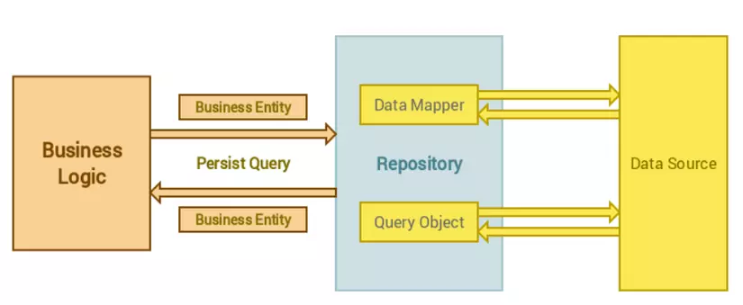

# Repository pattern

### 1. Concept: 
 
 - Repository is the intermediate part between business logic layer and data access layer. 
 - Repository is the place where you write all logic for retrieval data, instead of  writing  logic to 
get data directly in controller. Then controller will work with Repository instead of data assets

 The following diagram will show how does it work: 




 ### 2.Why we should use it

 - Write all logic for retrieval data in a place make help you easy to manage it in a centralized location. 
 - Decouple the data access layer with the rest of app make it more flexible . When you change some logic in the way retrieval data , it don't affect to the rest 
of application . For example, when you change underlying data source ( you are using relationship database ) to NoSQL. You only change some code in the Repository
- More readable, easier to maintain. 
- Avoid duplicate code. 
- Easy for test. 

### 3. Basic components of Repository pattern. 

 - Includes **Repository Interface**, **Concrete Repository**, **Entity Modal**

#### 1. Repository Interface. 

- You will declare all method that define how the data will retrieve. It includes some methods such as "delete", "update","create"... 

```php 
interface RepositoryInterface
{
    /**
     * Get all
     * @return mixed
     */
    public function getAll();

    /**
     * Get one
     * @param $id
     * @return mixed
     */
    public function find($id);

    /**
     * Create
     * @param array $attributes
     * @return mixed
     */
    public function create($attributes = []);

    /**
     * Update
     * @param $id
     * @param array $attributes
     * @return mixed
     */
    public function update($id, $attributes = []);

    /**
     * Delete
     * @param $id
     * @return mixed
     */
    public function delete($id);
}
```
- You can create an abstract class to implement actual logic which all concrete repo can use.
```php
 <?php

namespace App\Repositories;

use App\Repositories\RepositoryInterface;

abstract class BaseRepository implements RepositoryInterface
{
    //model muốn tương tác
    protected $model;

   //khởi tạo
    public function __construct()
    {
        $this->setModel();
    }

    //lấy model tương ứng
    abstract public function getModel();

    /**
     * Set model
     */
    public function setModel()
    {
        $this->model = app()->make(
            $this->getModel()
        );
    }

    public function getAll()
    {
        return $this->model->all();
    }

    public function find($id)
    {
        $result = $this->model->find($id);

        return $result;
    }

    public function create($attributes = [])
    {
        return $this->model->create($attributes);
    }

    public function update($id, $attributes = [])
    {
        $result = $this->find($id);
        if ($result) {
            $result->update($attributes);
            return $result;
        }

        return false;
    }

    public function delete($id)
    {
        $result = $this->find($id);
        if ($result) {
            $result->delete();

            return true;
        }

        return false;
    }
}

```
### 2. Concrete Repository 

- This is class place you implement actual logic for respective model. 
- Simply, You only need extends from BaseRepository and define method getModel to determine which model you want to work. 
- In there, You can define any method that you want to work data for that model . 
```php 
class ProductRepository extends BaseRepository 
{
    //lấy model tương ứng
    public function getModel()
    {
        return \App\Models\Product::class;
    }

    public function getProduct()
    {
        return $this->model->select('product_name')->take(5)->get();
    }
}
```

### 3.Entity model 

Represent a data object that repository will work to, it corresponds with table in datable
